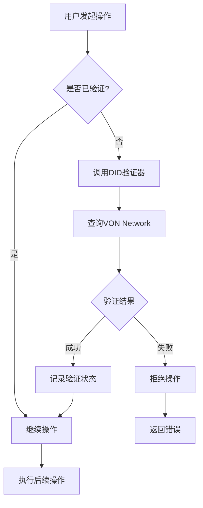
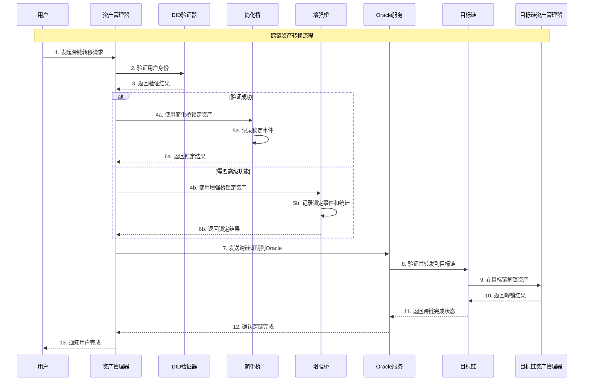
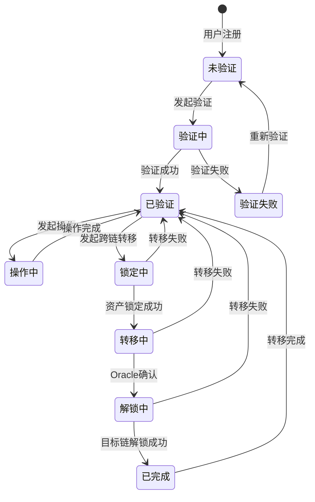
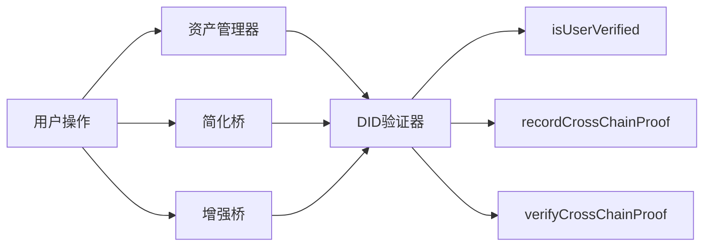
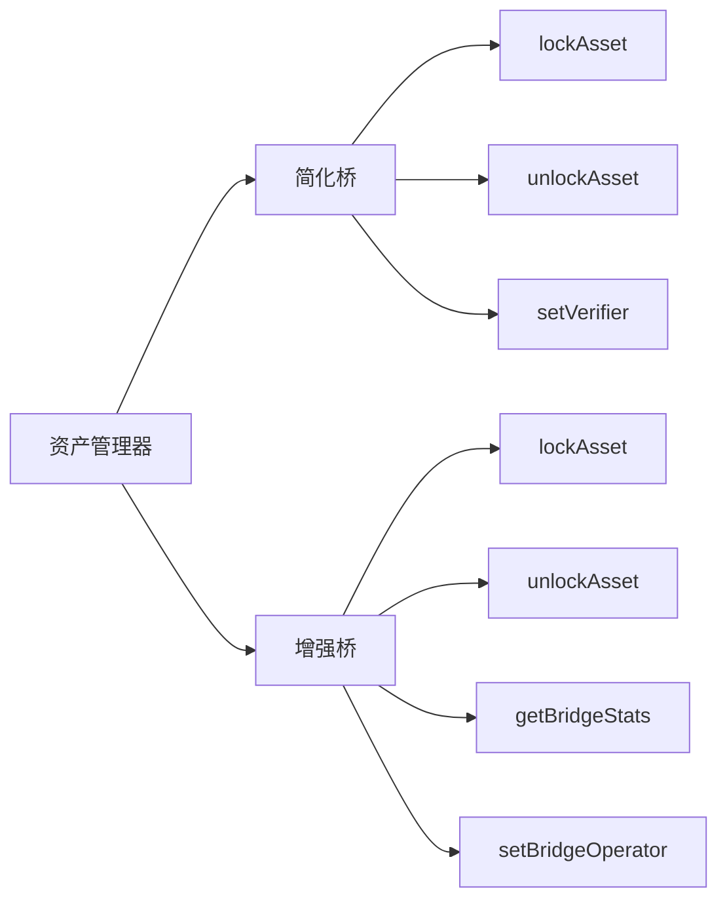
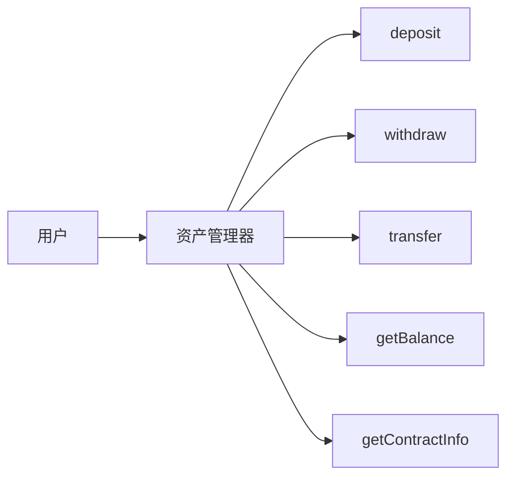
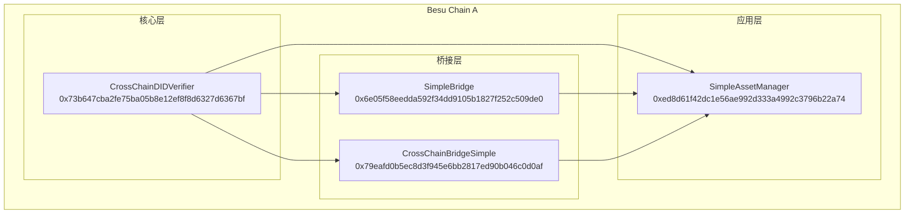
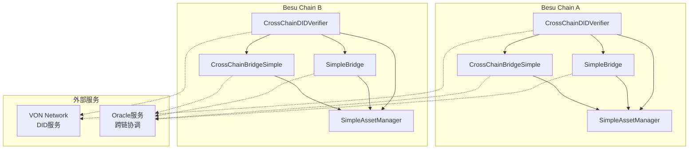
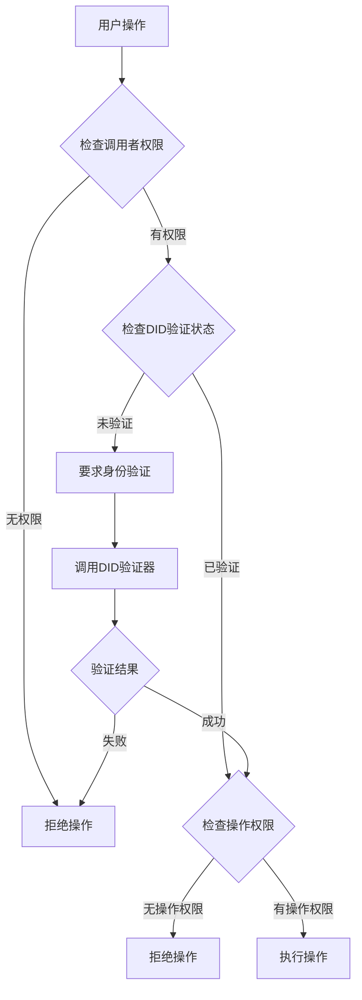
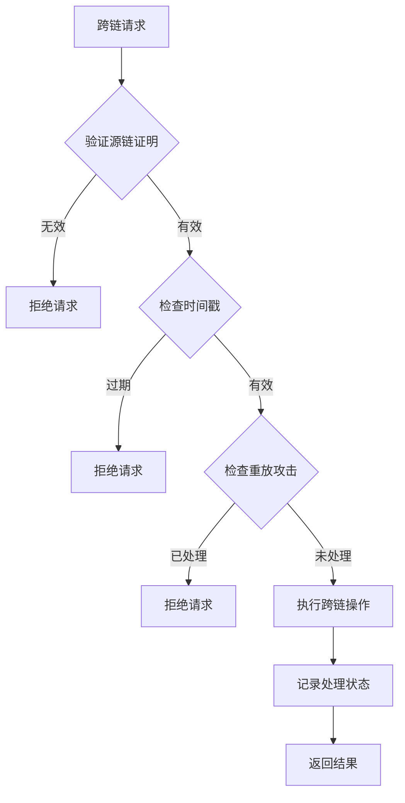

# 跨链合约交互流程图

## 🔄 完整跨链交易流程

### 1. 用户身份验证流程

### 2. 跨链资产转移详细流程

### 3. 合约状态管理流程

## 🔧 合约接口调用关系

### 1. DID验证器接口调用

### 2. 桥合约接口调用

### 3. 资产管理器接口调用

## 🏗️ 系统部署架构

### 1. 单链部署架构

### 2. 跨链部署架构

## 📊 合约功能矩阵

| 功能 | DID验证器 | 简化桥 | 增强桥 | 资产管理器 |
|------|-----------|--------|--------|------------|
| **身份验证** | ✅ 核心功能 | ❌ | ❌ | ❌ |
| **跨链锁定** | ❌ | ✅ 基础功能 | ✅ 增强功能 | ❌ |
| **跨链解锁** | ❌ | ✅ 基础功能 | ✅ 增强功能 | ❌ |
| **资产管理** | ❌ | ❌ | ❌ | ✅ 核心功能 |
| **统计跟踪** | ❌ | ❌ | ✅ 核心功能 | ❌ |
| **权限管理** | ✅ 高级功能 | ✅ 基础功能 | ✅ 高级功能 | ✅ 基础功能 |
| **事件记录** | ✅ 验证事件 | ✅ 桥事件 | ✅ 增强事件 | ✅ 资产事件 |

## 🔐 安全控制流程

### 1. 权限验证流程

### 2. 跨链安全验证

## 🎯 最佳实践建议

### 1. 合约调用顺序
1. **身份验证**: 首先验证用户身份
2. **权限检查**: 检查操作权限
3. **业务逻辑**: 执行具体业务操作
4. **状态更新**: 更新相关状态
5. **事件记录**: 记录操作事件

### 2. 错误处理
- 使用require进行输入验证
- 使用revert返回详细错误信息
- 记录所有异常情况
- 提供用户友好的错误消息

### 3. 事件设计
- 记录所有关键操作
- 包含足够的上下文信息
- 便于监控和审计
- 支持链下数据分析

### 4. 升级策略
- 保持接口兼容性
- 使用代理模式
- 渐进式升级
- 回滚机制

## 📈 性能优化建议

### 1. Gas优化
- 减少存储操作
- 使用事件替代存储
- 批量操作
- 优化循环

### 2. 调用优化
- 减少外部调用
- 缓存常用数据
- 异步处理
- 并行操作

### 3. 存储优化
- 使用packed结构
- 避免冗余存储
- 定期清理
- 压缩数据

这个详细的流程图和架构说明展示了4个核心合约之间的复杂关系，以及它们如何协同工作来实现完整的跨链功能。
