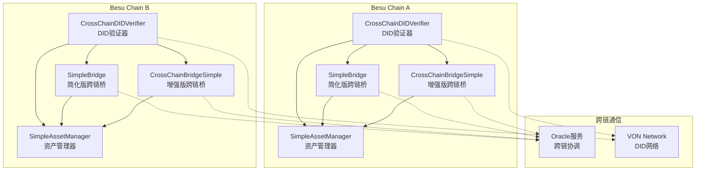
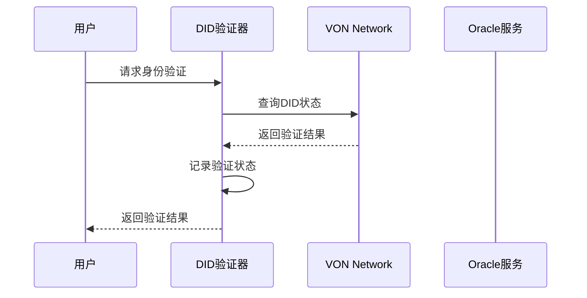
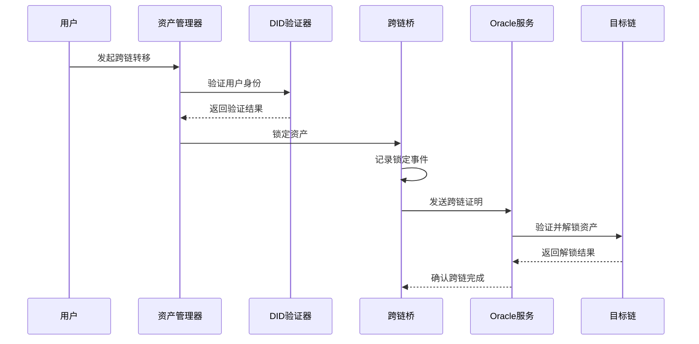

# 跨链合约关系架构说明

## 🏗️ 系统概述

本跨链系统由4个核心合约组成，它们协同工作实现基于DID的跨链资产转移和管理。每个合约都有特定的职责，通过精心设计的接口进行交互。

## 📋 核心合约列表

1. **CrossChainDIDVerifier** - DID验证器合约
2. **SimpleBridge** - 简化版跨链桥合约  
3. **CrossChainBridgeSimple** - 增强版跨链桥合约
4. **SimpleAssetManager** - 简化版资产管理合约

## 🔗 合约关系图



## 🎯 合约详细关系说明

### 1. CrossChainDIDVerifier (DID验证器)

**职责**: 管理用户身份验证和跨链证明

**核心功能**:
- 用户身份验证状态管理
- 跨链证明记录和验证
- 防止重放攻击
- 管理Oracle授权

**与其他合约的关系**:
- **被依赖**: 所有其他合约都依赖DID验证器
- **提供验证**: 为桥合约和资产管理器提供身份验证服务
- **管理权限**: 控制哪些地址可以执行跨链操作

**关键接口**:
```solidity
function isUserVerified(address user) public view returns (bool)
function recordCrossChainProof(bytes32 proofHash, string memory chainId) public
function verifyCrossChainProof(bytes32 proofHash, string memory chainId) public view returns (bool)
```

### 2. SimpleBridge (简化版跨链桥)

**职责**: 提供基本的跨链资产锁定和解锁功能

**核心功能**:
- 资产锁定（发送到目标链）
- 资产解锁（从源链接收）
- 基本的事件记录
- 简单的权限管理

**与其他合约的关系**:
- **依赖DID验证器**: 验证用户身份
- **被资产管理器使用**: 作为跨链操作的执行层
- **独立运行**: 可以独立处理跨链请求

**关键接口**:
```solidity
function lockAsset(uint256 amount, address token, string memory targetChain) public
function unlockAsset(uint256 amount, address token, string memory sourceChain) public
function setVerifier(address _verifier) public
```

### 3. CrossChainBridgeSimple (增强版跨链桥)

**职责**: 提供增强的跨链功能，包括统计和高级管理

**核心功能**:
- 跨链统计信息跟踪
- 高级事件记录
- 桥操作员管理
- 更复杂的权限控制

**与其他合约的关系**:
- **依赖DID验证器**: 进行身份验证
- **与SimpleBridge互补**: 提供更高级的功能
- **被资产管理器使用**: 作为高级跨链操作接口

**关键接口**:
```solidity
function lockAsset(uint256 amount, address token, string memory targetChain) public
function unlockAsset(uint256 amount, address token, string memory sourceChain, bytes32 sourceTxHash) public
function getBridgeStats() public view returns (uint256, uint256)
function setBridgeOperator(address _operator) public
```

### 4. SimpleAssetManager (简化版资产管理器)

**职责**: 管理用户资产和跨链操作

**核心功能**:
- ETH存款和取款
- 资产转账
- 跨链操作协调
- 用户余额管理

**与其他合约的关系**:
- **依赖DID验证器**: 验证用户身份
- **使用桥合约**: 执行跨链操作
- **管理用户资产**: 为用户提供资产管理接口

**关键接口**:
```solidity
function deposit() public payable
function withdraw(uint256 amount) public
function transfer(address to, uint256 amount) public
function getBalance(address user) public view returns (uint256)
```

## 🔄 跨链工作流程

### 1. 用户注册和验证流程



### 2. 跨链资产转移流程



## 🏛️ 系统架构层次

### 第一层：身份验证层
- **CrossChainDIDVerifier**: 提供统一的身份验证服务
- **职责**: 确保所有操作都经过身份验证

### 第二层：跨链通信层
- **SimpleBridge**: 基础跨链功能
- **CrossChainBridgeSimple**: 增强跨链功能
- **职责**: 处理跨链资产转移

### 第三层：资产管理层
- **SimpleAssetManager**: 用户资产管理
- **职责**: 为用户提供资产管理接口

### 第四层：外部服务层
- **Oracle服务**: 跨链协调
- **VON Network**: DID网络服务
- **职责**: 提供外部服务支持

## 🔐 安全机制

### 1. 身份验证安全
- 所有操作都需要DID验证
- 防止未授权访问
- 支持跨链身份验证

### 2. 跨链安全
- 防重放攻击机制
- 跨链证明验证
- 时间戳验证

### 3. 权限管理
- 多级权限控制
- 操作员管理
- 所有者权限

## 📊 合约交互矩阵

| 合约 | DID验证器 | 简化桥 | 增强桥 | 资产管理器 |
|------|-----------|--------|--------|------------|
| **DID验证器** | - | 提供验证 | 提供验证 | 提供验证 |
| **简化桥** | 请求验证 | - | 互补功能 | 被调用 |
| **增强桥** | 请求验证 | 互补功能 | - | 被调用 |
| **资产管理器** | 请求验证 | 调用桥功能 | 调用桥功能 | - |

## 🚀 扩展性设计

### 1. 水平扩展
- 可以添加更多链
- 支持更多代币类型
- 支持更多桥合约

### 2. 垂直扩展
- 可以增强现有合约功能
- 可以添加新的合约类型
- 可以集成更多外部服务

### 3. 模块化设计
- 每个合约职责单一
- 接口清晰定义
- 易于维护和升级

## 💡 最佳实践

### 1. 合约部署顺序
1. 首先部署DID验证器
2. 然后部署桥合约
3. 最后部署资产管理器
4. 配置合约间的依赖关系

### 2. 权限管理
- 使用多签钱包管理关键权限
- 定期轮换操作员
- 监控异常操作

### 3. 监控和审计
- 记录所有关键操作
- 定期审计合约状态
- 监控跨链交易

## 🎯 总结

本跨链系统通过4个核心合约的协同工作，实现了基于DID的跨链资产转移和管理。系统设计遵循了模块化、可扩展和安全的原则，为后续的功能扩展和优化奠定了坚实的基础。

**核心优势**:
- ✅ 模块化设计，职责清晰
- ✅ 安全性高，多重验证
- ✅ 可扩展性强，易于维护
- ✅ 跨链一致性，统一管理

**技术特点**:
- 🔐 基于DID的身份验证
- 🌉 双桥设计，功能互补
- 💰 统一的资产管理
- 🔄 完整的跨链流程
