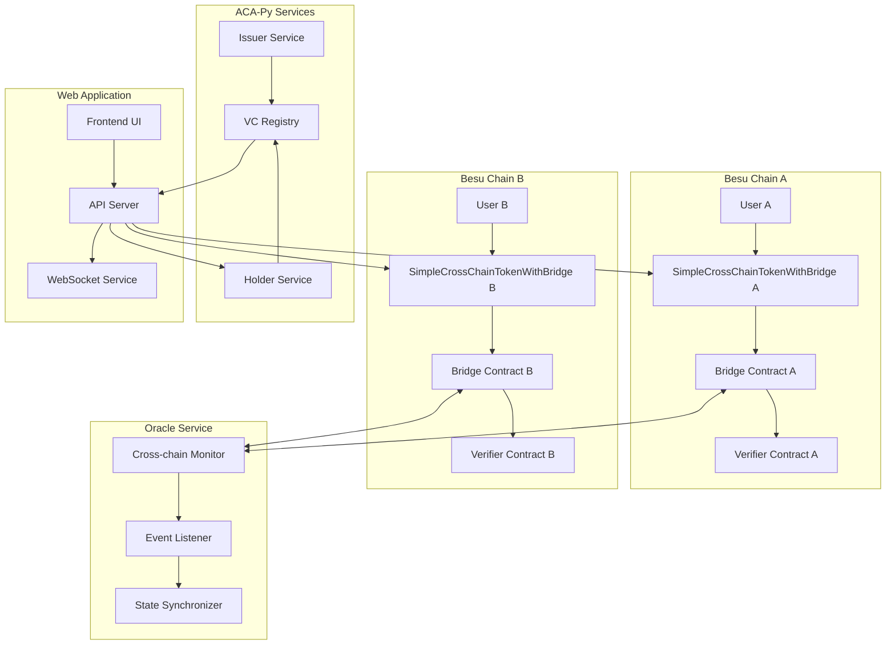
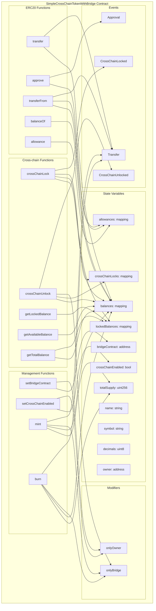
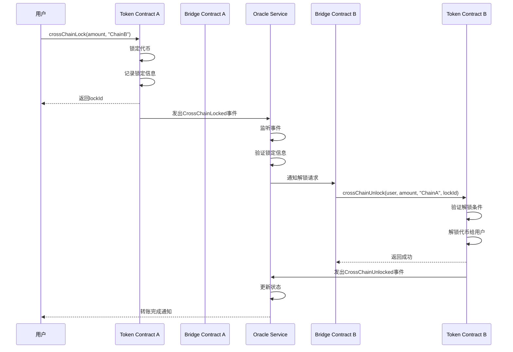
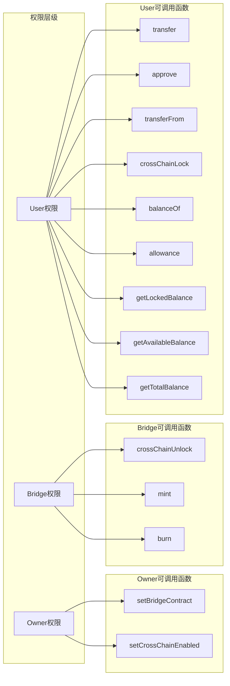
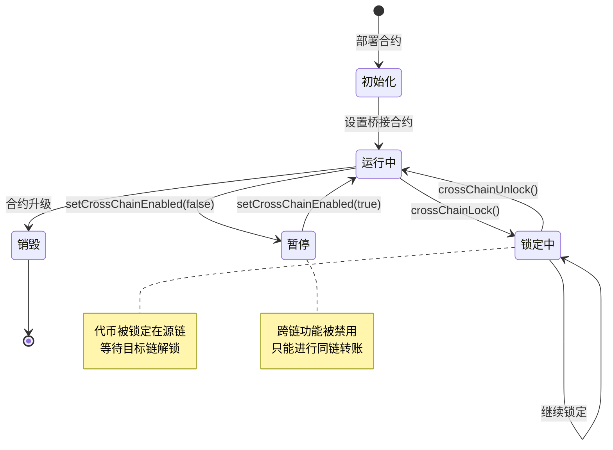

# 智能合约关系架构图

## 系统整体架构

```mermaid
graph TB
    subgraph "Besu Chain A"
        A1[SimpleCrossChainTokenWithBridge A]
        A2[Bridge Contract A]
        A3[Verifier Contract A]
        A4[User A]
    end
    
    subgraph "Besu Chain B"
        B1[SimpleCrossChainTokenWithBridge B]
        B2[Bridge Contract B]
        B3[Verifier Contract B]
        B4[User B]
    end
    
    subgraph "Oracle Service"
        O1[Cross-chain Monitor]
        O2[Event Listener]
        O3[State Synchronizer]
    end
    
    subgraph "ACA-Py Services"
        AC1[Issuer Service]
        AC2[Holder Service]
        AC3[VC Registry]
    end
    
    subgraph "Web Application"
        W1[Frontend UI]
        W2[API Server]
        W3[WebSocket Service]
    end
    
    A1 --> A2
    A2 --> A3
    A4 --> A1
    
    B1 --> B2
    B2 --> B3
    B4 --> B1
    
    A2 <--> O1
    B2 <--> O1
    O1 --> O2
    O2 --> O3
    
    AC1 --> AC3
    AC2 --> AC3
    AC3 --> W2
    
    W1 --> W2
    W2 --> W3
    W2 --> A1
    W2 --> B1
    W2 --> AC2
```

## 智能合约内部关系

```mermaid
graph TD
    subgraph "SimpleCrossChainTokenWithBridge Contract"
        subgraph "State Variables"
            SV1[name: string]
            SV2[symbol: string]
            SV3[decimals: uint8]
            SV4[totalSupply: uint256]
            SV5[balances: mapping]
            SV6[allowances: mapping]
            SV7[bridgeContract: address]
            SV8[owner: address]
            SV9[crossChainEnabled: bool]
            SV10[crossChainLocks: mapping]
            SV11[lockedBalances: mapping]
        end
        
        subgraph "ERC20 Functions"
            ERC1[transfer]
            ERC2[approve]
            ERC3[transferFrom]
            ERC4[balanceOf]
            ERC5[allowance]
        end
        
        subgraph "Cross-chain Functions"
            CC1[crossChainLock]
            CC2[crossChainUnlock]
            CC3[getLockedBalance]
            CC4[getAvailableBalance]
            CC5[getTotalBalance]
        end
        
        subgraph "Management Functions"
            MG1[setBridgeContract]
            MG2[setCrossChainEnabled]
            MG3[mint]
            MG4[burn]
        end
        
        subgraph "Events"
            EV1[Transfer]
            EV2[Approval]
            EV3[CrossChainLocked]
            EV4[CrossChainUnlocked]
        end
        
        subgraph "Modifiers"
            MOD1[onlyOwner]
            MOD2[onlyBridge]
        end
    end
    
    ERC1 --> SV5
    ERC2 --> SV6
    ERC3 --> SV5
    ERC3 --> SV6
    ERC4 --> SV5
    ERC5 --> SV6
    
    CC1 --> SV5
    CC1 --> SV11
    CC1 --> SV10
    CC2 --> SV5
    CC2 --> SV10
    CC3 --> SV11
    CC4 --> SV5
    CC5 --> SV5
    CC5 --> SV11
    
    MG1 --> SV7
    MG2 --> SV9
    MG3 --> SV4
    MG3 --> SV5
    MG4 --> SV4
    MG4 --> SV5
    
    MG1 --> MOD1
    MG2 --> MOD1
    MG3 --> MOD2
    MG4 --> MOD2
    CC2 --> MOD2
    
    CC1 --> EV3
    CC2 --> EV4
    ERC1 --> EV1
    ERC2 --> EV2
    ERC3 --> EV1
    MG3 --> EV1
    MG4 --> EV1
```

## 跨链转账数据流

```mermaid
sequenceDiagram
    participant User as 用户
    participant TokenA as Token Contract A
    participant BridgeA as Bridge Contract A
    participant Oracle as Oracle Service
    participant BridgeB as Bridge Contract B
    participant TokenB as Token Contract B
    
    User->>TokenA: crossChainLock(amount, "ChainB")
    TokenA->>TokenA: 锁定代币
    TokenA->>TokenA: 记录锁定信息
    TokenA-->>User: 返回lockId
    TokenA->>Oracle: 发出CrossChainLocked事件
    
    Oracle->>Oracle: 监听事件
    Oracle->>Oracle: 验证锁定信息
    Oracle->>BridgeB: 通知解锁请求
    
    BridgeB->>TokenB: crossChainUnlock(user, amount, "ChainA", lockId)
    TokenB->>TokenB: 验证解锁条件
    TokenB->>TokenB: 解锁代币给用户
    TokenB-->>BridgeB: 返回成功
    TokenB->>Oracle: 发出CrossChainUnlocked事件
    
    Oracle->>Oracle: 更新状态
    Oracle-->>User: 转账完成通知
```

## 权限控制关系

```mermaid
graph LR
    subgraph "权限层级"
        P1[Owner权限]
        P2[Bridge权限]
        P3[User权限]
    end
    
    subgraph "Owner可调用函数"
        O1[setBridgeContract]
        O2[setCrossChainEnabled]
    end
    
    subgraph "Bridge可调用函数"
        B1[crossChainUnlock]
        B2[mint]
        B3[burn]
    end
    
    subgraph "User可调用函数"
        U1[transfer]
        U2[approve]
        U3[transferFrom]
        U4[crossChainLock]
        U5[balanceOf]
        U6[allowance]
        U7[getLockedBalance]
        U8[getAvailableBalance]
        U9[getTotalBalance]
    end
    
    P1 --> O1
    P1 --> O2
    P2 --> B1
    P2 --> B2
    P2 --> B3
    P3 --> U1
    P3 --> U2
    P3 --> U3
    P3 --> U4
    P3 --> U5
    P3 --> U6
    P3 --> U7
    P3 --> U8
    P3 --> U9
```

## 状态转换图

```mermaid
stateDiagram-v2
    [*] --> 初始化: 部署合约
    初始化 --> 运行中: 设置桥接合约
    
    运行中 --> 锁定中: crossChainLock()
    锁定中 --> 运行中: crossChainUnlock()
    锁定中 --> 锁定中: 继续锁定
    
    运行中 --> 暂停: setCrossChainEnabled(false)
    暂停 --> 运行中: setCrossChainEnabled(true)
    
    运行中 --> 销毁: 合约升级
    销毁 --> [*]
    
    note right of 锁定中
        代币被锁定在源链
        等待目标链解锁
    end note
    
    note right of 暂停
        跨链功能被禁用
        只能进行同链转账
    end note
```
