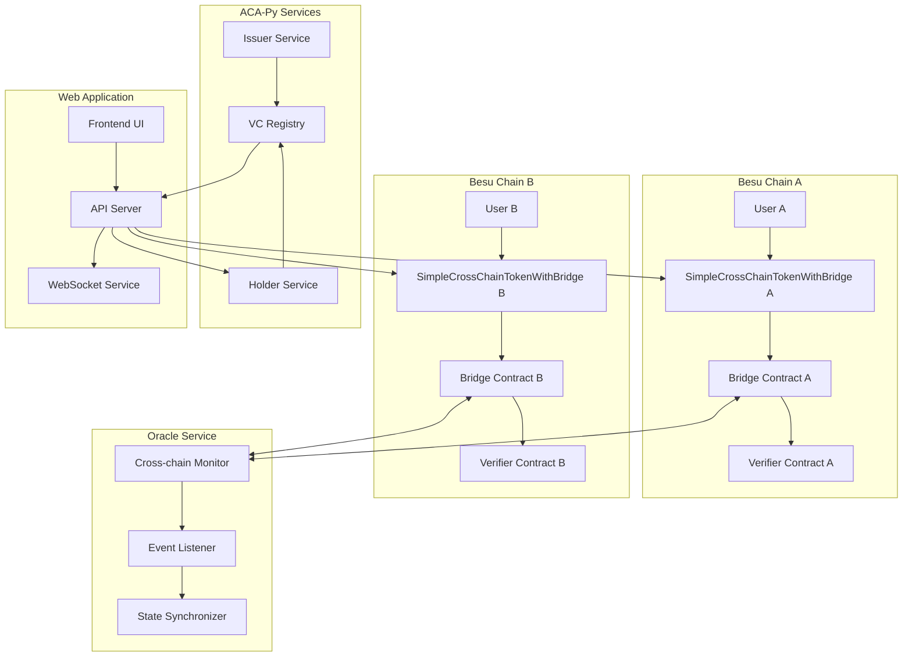
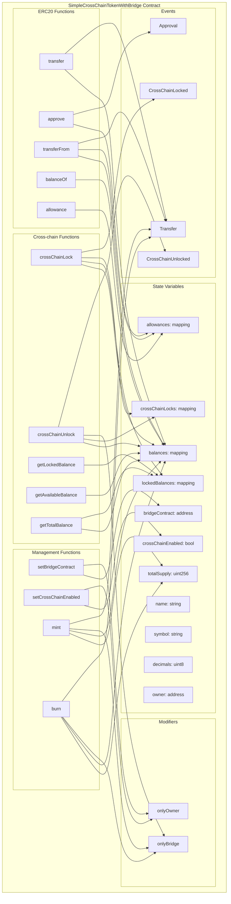
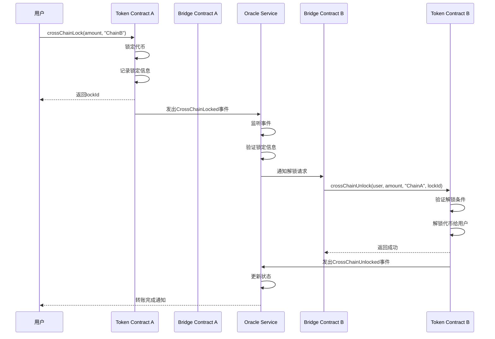

# 智能合约技术文档

## 目录
1. [合约功能说明](#合约功能说明)
2. [系统架构图](#系统架构图)
3. [跨链转账流程](#跨链转账流程)
4. [API接口文档](#api接口文档)
5. [部署指南](#部署指南)

## 合约功能说明

### 核心功能模块

#### 1. ERC20标准功能
- **代币基本信息**: name, symbol, decimals, totalSupply
- **余额管理**: balances映射, allowances映射
- **转账功能**: transfer(), approve(), transferFrom()
- **查询功能**: balanceOf(), allowance()

#### 2. 跨链功能
- **锁定机制**: crossChainLock() - 在源链锁定代币
- **解锁机制**: crossChainUnlock() - 在目标链解锁代币
- **状态查询**: getLockedBalance(), getAvailableBalance(), getTotalBalance()
- **权限控制**: onlyOwner, onlyBridge修饰符

#### 3. 代币管理
- **铸造功能**: mint() - 仅桥接合约可调用
- **销毁功能**: burn() - 仅桥接合约可调用
- **配置管理**: setBridgeContract(), setCrossChainEnabled()

### 数据结构

```solidity
struct CrossChainLock {
    address user;        // 用户地址
    uint256 amount;      // 锁定金额
    string targetChain;  // 目标链标识
    uint256 lockTime;    // 锁定时间
    bool isUnlocked;     // 是否已解锁
}
```

### 事件定义

```solidity
event Transfer(address indexed from, address indexed to, uint256 value);
event Approval(address indexed owner, address indexed spender, uint256 value);
event CrossChainLocked(address indexed user, uint256 amount, string targetChain, bytes32 lockId);
event CrossChainUnlocked(address indexed user, uint256 amount, string sourceChain, bytes32 lockId);
```

## 系统架构图

### 整体架构



### 合约内部关系



## 跨链转账流程

### 完整流程

```mermaid
flowchart TD
    Start([用户发起跨链转账]) --> Check1{检查跨链功能是否启用}
    Check1 -->|否| Error1[返回错误: 跨链功能已禁用]
    Check1 -->|是| Check2{检查用户余额是否充足}
    
    Check2 -->|否| Error2[返回错误: 余额不足]
    Check2 -->|是| Lock[调用 crossChainLock 锁定代币]
    
    Lock --> Update1[更新用户余额: balances -= amount]
    Update1 --> Update2[更新锁定余额: lockedBalances += amount]
    Update2 --> Generate[生成锁定ID: keccak256(user, amount, targetChain, timestamp, blockNumber)]
    Generate --> Record[记录锁定信息到 crossChainLocks]
    Record --> Emit1[发出 CrossChainLocked 事件]
    
    Emit1 --> Oracle[Oracle服务监听事件]
    Oracle --> Verify1[验证锁定信息]
    Verify1 --> Notify[通知目标链桥接合约]
    
    Notify --> Bridge[目标链桥接合约接收通知]
    Bridge --> Verify2[验证解锁条件]
    Verify2 --> Unlock[调用 crossChainUnlock 解锁代币]
    
    Unlock --> Check3{检查锁定记录是否存在且未解锁}
    Check3 -->|否| Error3[返回错误: 锁定记录无效]
    Check3 -->|是| Update3[更新用户余额: balances += amount]
    Update3 --> Update4[更新锁定记录: isUnlocked = true]
    Update4 --> Emit2[发出 CrossChainUnlocked 事件]
    
    Emit2 --> Success[跨链转账成功]
    Success --> End([转账完成])
    
    Error1 --> End
    Error2 --> End
    Error3 --> End
```

### 时序图



## API接口文档

### 智能合约接口

#### 标准ERC20接口
```solidity
function transfer(address to, uint256 amount) public returns (bool)
function approve(address spender, uint256 amount) public returns (bool)
function transferFrom(address from, address to, uint256 amount) public returns (bool)
function balanceOf(address account) public view returns (uint256)
function allowance(address owner, address spender) public view returns (uint256)
```

#### 跨链接口
```solidity
function crossChainLock(uint256 amount, string memory targetChain) public returns (bytes32)
function crossChainUnlock(address user, uint256 amount, string memory sourceChain, bytes32 lockId) public onlyBridge returns (bool)
function getLockedBalance(address user) public view returns (uint256)
function getAvailableBalance(address user) public view returns (uint256)
function getTotalBalance(address user) public view returns (uint256)
```

#### 管理接口
```solidity
function setBridgeContract(address _bridgeContract) public onlyOwner
function setCrossChainEnabled(bool _enabled) public onlyOwner
function mint(address to, uint256 amount) public onlyBridge returns (bool)
function burn(address from, uint256 amount) public onlyBridge returns (bool)
```

### Web API接口

#### 系统状态
- `GET /api/status` - 获取系统状态
- `GET /api/contracts` - 获取合约信息

#### 跨链转账
- `POST /api/transfer` - 执行跨链转账
- `GET /api/transfer-history` - 获取转账历史

#### VC数据
- `GET /api/vc-list` - 获取VC列表
- `GET /api/vc-detail/<vc_id>` - 获取VC详情

#### 合约变量
- `GET /api/contract-variables` - 获取合约内部变量

## 部署指南

### 环境要求
- Solidity 0.5.16+
- Web3.py 5.0+
- Python 3.8+
- Node.js 16+

### 部署步骤

1. **编译合约**
```bash
solc --abi --bin SimpleCrossChainTokenWithBridge.sol
```

2. **部署合约**
```python
from web3 import Web3

# 连接区块链
w3 = Web3(Web3.HTTPProvider('http://localhost:8545'))

# 部署合约
contract = w3.eth.contract(abi=abi, bytecode=bytecode)
tx_hash = contract.constructor("CrossChainToken", "CCT", 18, 1000000).transact()
```

3. **初始化配置**
```python
# 设置桥接合约地址
contract.functions.setBridgeContract(bridge_address).transact()

# 启用跨链功能
contract.functions.setCrossChainEnabled(True).transact()
```

### 安全注意事项

1. **权限管理**
   - 确保只有授权地址可以调用管理函数
   - 定期检查权限设置

2. **输入验证**
   - 验证所有输入参数
   - 检查地址和金额的有效性

3. **状态一致性**
   - 确保余额状态的一致性
   - 监控锁定和解锁状态

4. **事件监控**
   - 监控所有重要事件
   - 及时处理异常情况

## 测试指南

### 单元测试
```python
def test_cross_chain_lock():
    # 测试跨链锁定功能
    pass

def test_cross_chain_unlock():
    # 测试跨链解锁功能
    pass

def test_balance_management():
    # 测试余额管理
    pass
```

### 集成测试
```python
def test_full_cross_chain_transfer():
    # 测试完整跨链转账流程
    pass
```

### 性能测试
```python
def test_concurrent_transfers():
    # 测试并发转账
    pass
```

## 监控和维护

### 关键指标
- 锁定代币数量
- 解锁成功率
- 平均处理时间
- 错误率

### 告警设置
- 余额异常告警
- 锁定超时告警
- 合约调用失败告警

### 维护任务
- 定期检查合约状态
- 更新权限配置
- 优化性能参数
- 备份重要数据
