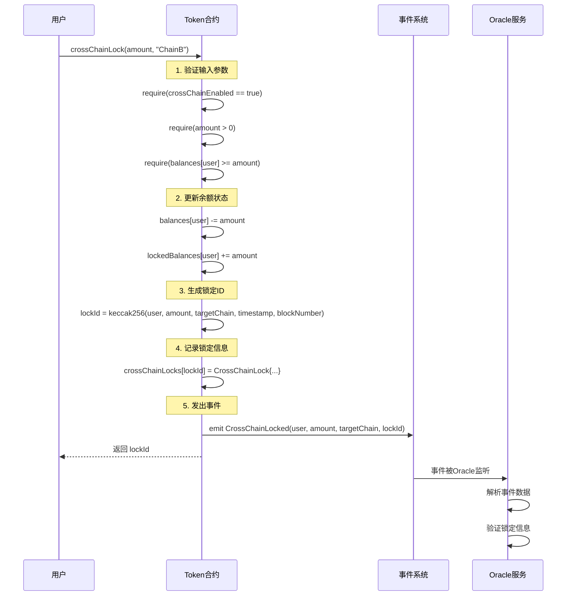
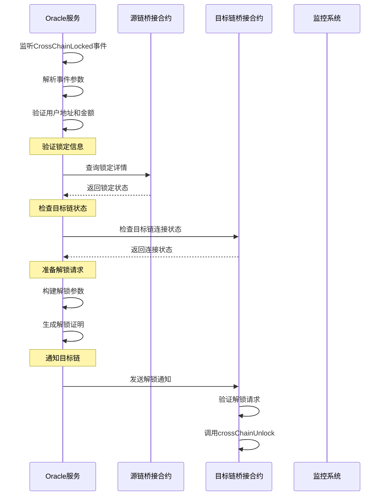
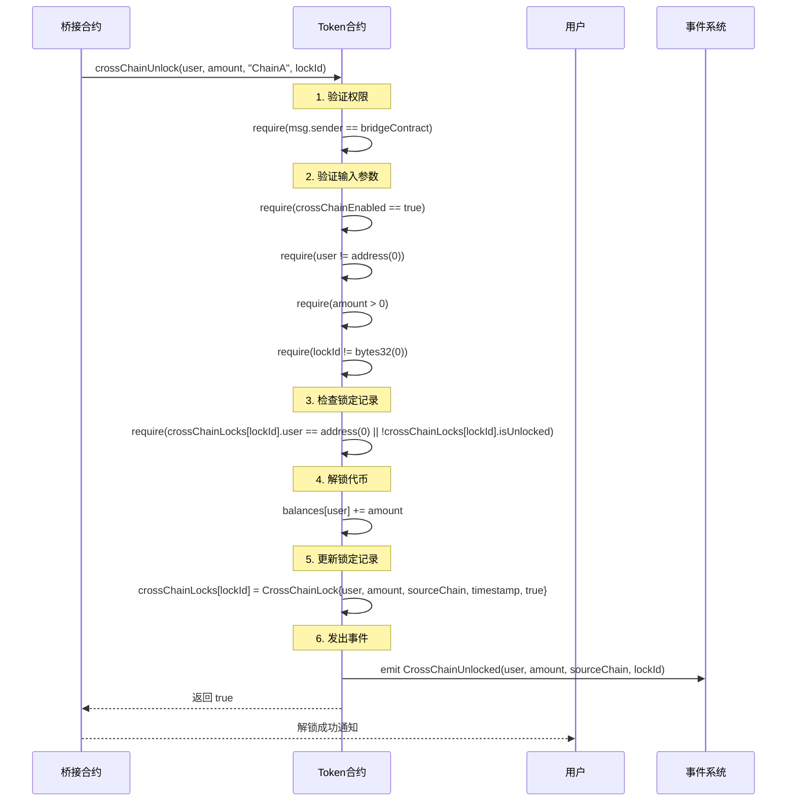
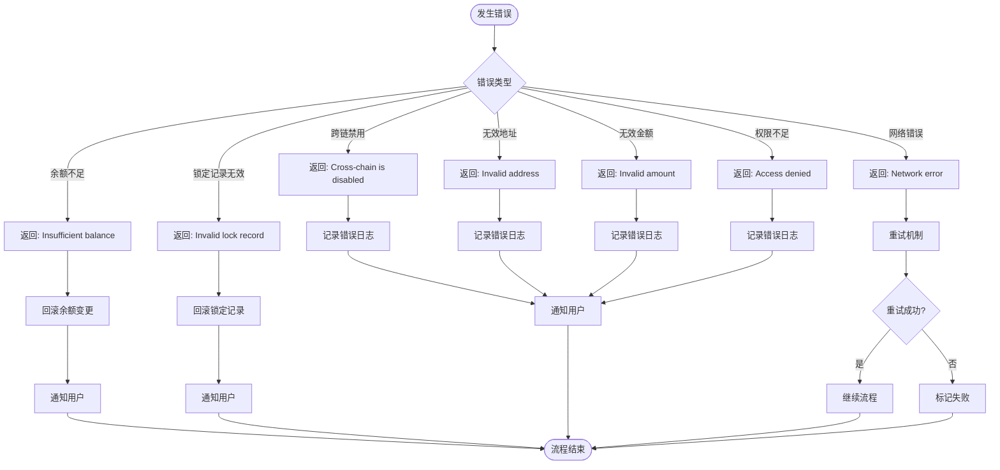
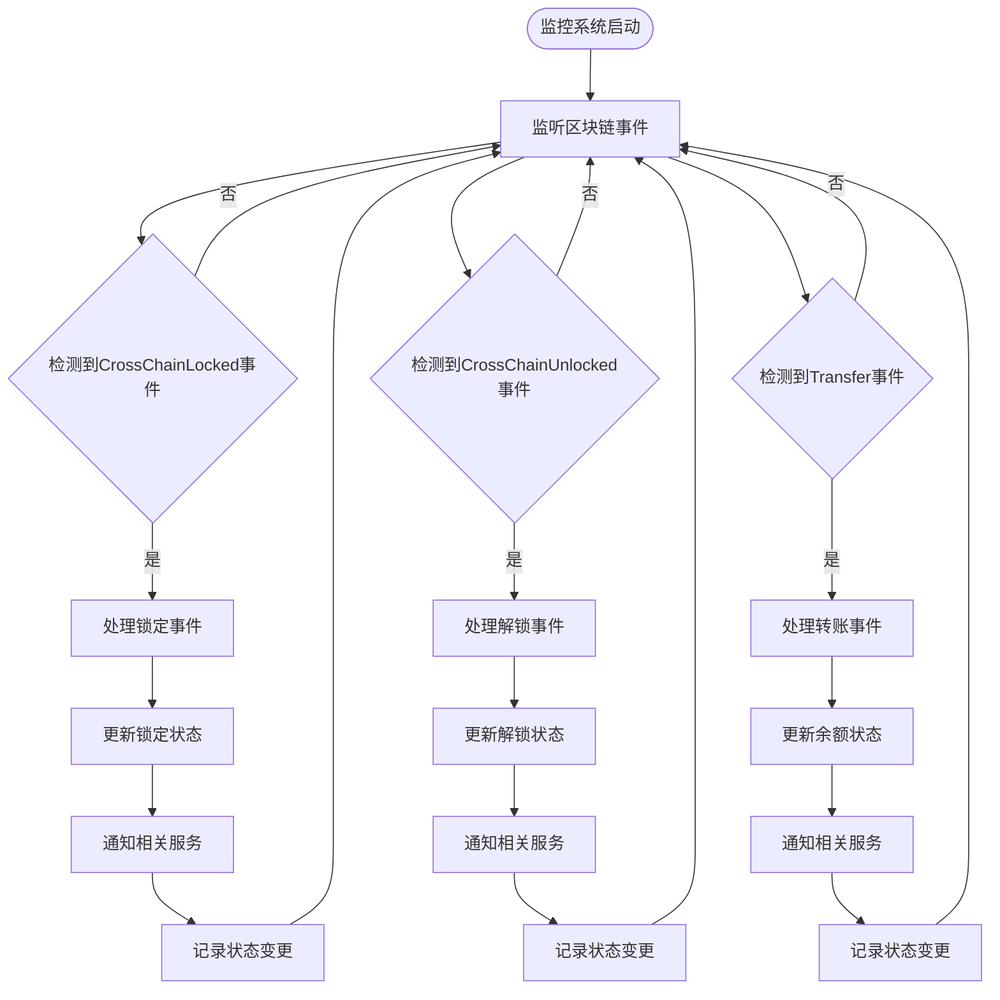

# 跨链转账流程图

## 完整跨链转账流程

```mermaid
flowchart TD
    Start([用户发起跨链转账]) --> Check1{检查跨链功能是否启用}
    Check1 -->|否| Error1[返回错误: 跨链功能已禁用]
    Check1 -->|是| Check2{检查用户余额是否充足}
    
    Check2 -->|否| Error2[返回错误: 余额不足]
    Check2 -->|是| Lock[调用 crossChainLock 锁定代币]
    
    Lock --> Update1[更新用户余额: balances -= amount]
    Update1 --> Update2[更新锁定余额: lockedBalances += amount]
    Update2 --> Generate[生成锁定ID: keccak256(user, amount, targetChain, timestamp, blockNumber)]
    Generate --> Record[记录锁定信息到 crossChainLocks]
    Record --> Emit1[发出 CrossChainLocked 事件]
    
    Emit1 --> Oracle[Oracle服务监听事件]
    Oracle --> Verify1[验证锁定信息]
    Verify1 --> Notify[通知目标链桥接合约]
    
    Notify --> Bridge[目标链桥接合约接收通知]
    Bridge --> Verify2[验证解锁条件]
    Verify2 --> Unlock[调用 crossChainUnlock 解锁代币]
    
    Unlock --> Check3{检查锁定记录是否存在且未解锁}
    Check3 -->|否| Error3[返回错误: 锁定记录无效]
    Check3 -->|是| Update3[更新用户余额: balances += amount]
    Update3 --> Update4[更新锁定记录: isUnlocked = true]
    Update4 --> Emit2[发出 CrossChainUnlocked 事件]
    
    Emit2 --> Success[跨链转账成功]
    Success --> End([转账完成])
    
    Error1 --> End
    Error2 --> End
    Error3 --> End
```

## 详细步骤说明

### 阶段1: 源链锁定



### 阶段2: Oracle验证与通知



### 阶段3: 目标链解锁



## 错误处理流程



## 状态监控流程



## 性能优化策略

### 1. 批量处理
- 批量处理多个锁定请求
- 批量验证解锁条件
- 批量更新状态

### 2. 缓存机制
- 缓存锁定记录
- 缓存余额状态
- 缓存合约状态

### 3. 异步处理
- 异步事件处理
- 异步状态更新
- 异步通知发送

### 4. 监控告警
- 实时状态监控
- 异常情况告警
- 性能指标统计
